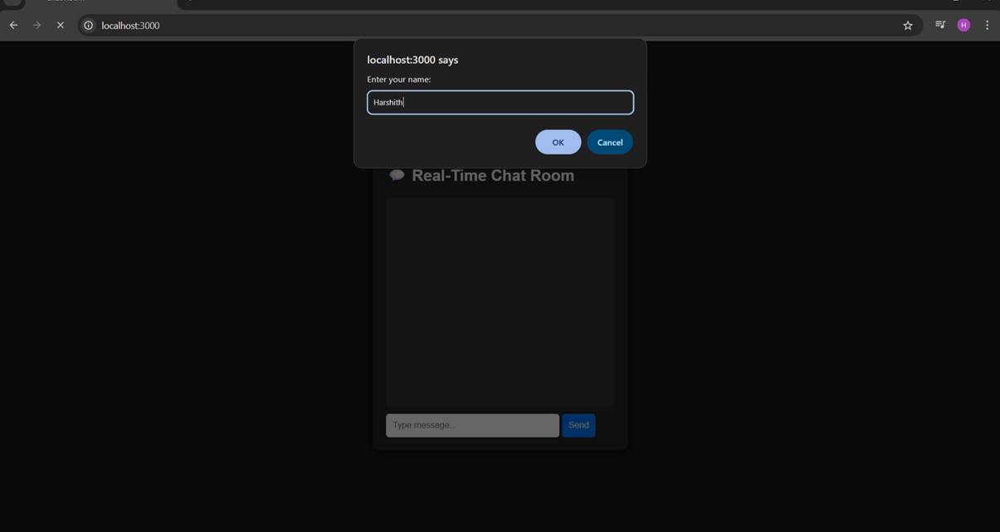
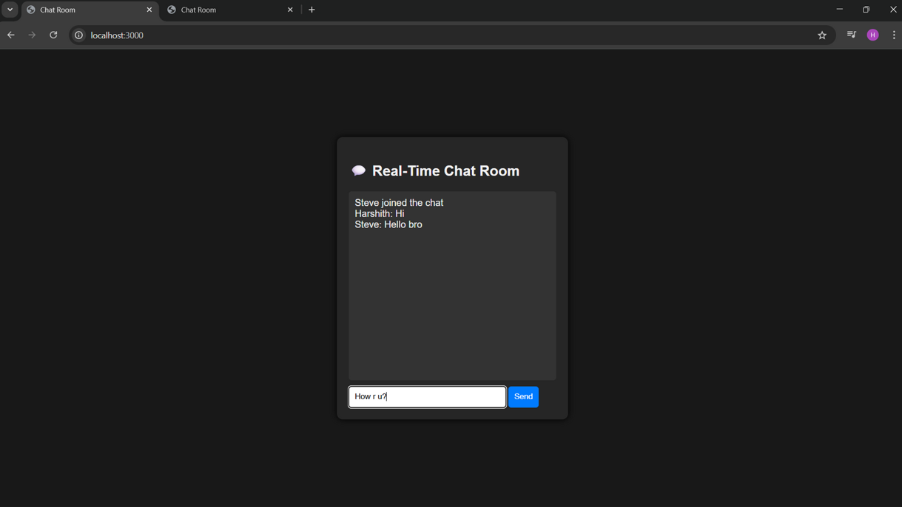

# 💬 Node.js Real-Time Chat Application

A real-time chat application built with **Node.js**, **Express**, and **Socket.IO** that enables multiple users to exchange messages instantly in a shared chat room over WebSockets.

> 💡 After building this, I developed **[Open Chat Application](https://github.com/Harshith1702/Open_Chat_Application)** — a completely separate, far more complex project with chat rooms, user authentication, and live deployment on Render.

---

## ✨ Features

- ⚡ Real-time bidirectional messaging via WebSockets
- 👥 Multi-user support in a shared global chat room
- 🔔 Join & leave notifications broadcast to all users
- 🌑 Clean dark-themed responsive UI
- 🔄 Auto-scroll to latest messages

---

## 🛠️ Tech Stack

| Layer    | Technology             |
|----------|------------------------|
| Runtime  | Node.js                |
| Framework| Express.js             |
| Sockets  | Socket.IO              |
| Frontend | HTML, CSS, JavaScript  |

---

## 📁 Project Structure

```
ChatApp/
├── public/
│   ├── main.html       # Chat UI
│   ├── app.js          # Client-side Socket.IO logic
│   └── cell.css        # Dark theme styling
├── server.js           # Express + Socket.IO server
└── package.json
```

---

## ⚙️ Getting Started

**1. Clone the repo**
```bash
git clone https://github.com/Harshith1702/Nodejs-real-time-chat
cd Nodejs-real-time-chat
```

**2. Install dependencies**
```bash
npm install
```

**3. Start the server**
```bash
node server.js
```

**4. Open in browser**
```
http://localhost:4000
```

> 💡 Open multiple browser tabs to simulate multiple users chatting in real time.

---

## 🔌 How It Works

```
Client A  ──────────────────────────────────────────►  Server (Socket.IO)
  │   emit('chat-message', msg)                              │
  │                                                          │ io.emit('message', ...)
  │                                                          ▼
Client B  ◄─────────────────────────  Receives message instantly
Client C  ◄─────────────────────────  Receives message instantly
```

- On connect → user enters their name via prompt
- Server stores `socket.username` and broadcasts join event
- Messages are emitted to **all** connected clients via `io.emit()`
- On disconnect → server notifies remaining users

---

## 📸 Screenshots

| Interface | Chat in Action |
|-----------|----------------|
|  |  |

---

## 💡 What I Learned

- Real-time bidirectional communication using Socket.IO
- Difference between `socket.emit()`, `socket.broadcast.emit()`, and `io.emit()`
- Managing multiple concurrent WebSocket connections
- Serving a frontend with Express static middleware

---

## 🔗 Related Projects

- **[Open Chat Application](https://github.com/Harshith1702/Open_Chat_Application)** — A separate, more advanced project featuring chat rooms, authentication, and live deployment on Render

---

*Built as a Node.js lab mini project — 3rd Semester | CMR Technical Campus*
